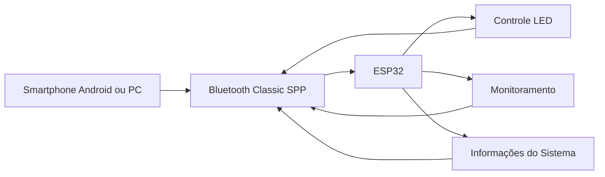
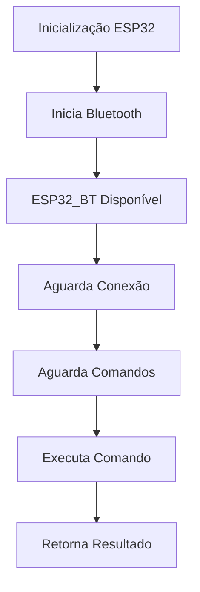
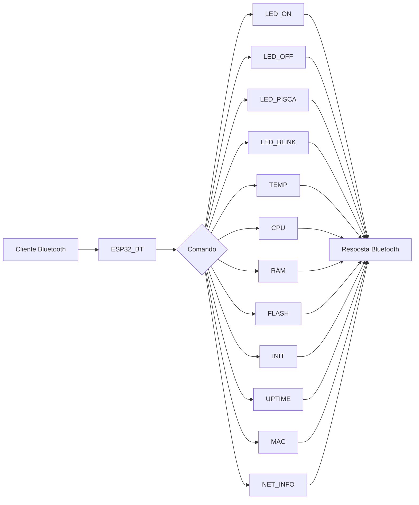
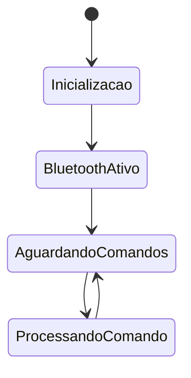

# 🔵 ESP32 Bluetooth Remote Control & System Monitor

Sistema de controle remoto e monitoramento para ESP32 utilizando **Bluetooth Classic (SPP)**.

O firmware permite controlar o LED onboard, executar comandos remotos e consultar informações detalhadas do sistema diretamente através de uma conexão Bluetooth, sem necessidade de Wi-Fi ou Internet. 【1-f49dfa】

---

# ✨ Funcionalidades

✅ Comunicação Bluetooth Classic (SPP)

✅ Controle remoto do LED onboard

✅ Blink contínuo assíncrono

✅ Piscar LED com quantidade e tempo configuráveis

✅ Monitoramento da temperatura interna

✅ Informações completas da CPU

✅ Informações de memória RAM

✅ Informações da memória Flash

✅ Consulta do uptime

✅ Consulta do MAC Address

✅ Informações de rede

✅ Consulta do motivo do último reset

✅ Compatível com smartphones Android

✅ Compatível com aplicativos de terminal Bluetooth

【1-f49dfa】

---

# 🏗️ Arquitetura



---

# 📦 Hardware Utilizado

| Componente | Função |
|------------|---------|
| ESP32 | Controlador principal |
| LED GPIO 2 | Sinalização visual |
| Bluetooth Classic | Comunicação sem fio |

【1-f49dfa】

---

# 📚 Bibliotecas Utilizadas

```cpp
#include "BluetoothSerial.h"
#include <WiFi.h>
```

【1-f49dfa】

---

# 🚀 Inicialização

Ao iniciar, o ESP32 cria um dispositivo Bluetooth com o nome:

```text
ESP32_BT
```

O dispositivo ficará visível para pareamento em computadores e smartphones compatíveis com Bluetooth Classic. 【1-f49dfa】

---

# 📲 Aplicativo Recomendado para Android

Para testes utilizando smartphones Android recomenda-se o aplicativo:

## Serial Bluetooth Terminal

O aplicativo permite:

- Conectar ao ESP32 via Bluetooth Classic
- Enviar comandos manualmente
- Receber respostas em tempo real
- Criar macros e botões personalizados
- Visualizar logs da comunicação

### Instalação

Google Play:

https://play.google.com/store/apps/details?id=de.kai_morich.serial_bluetooth_terminal

### Como Conectar

1. Ligue o ESP32.
2. Emparelhe o celular com:
   ```text
   ESP32_BT
   ```
3. Abra o aplicativo Serial Bluetooth Terminal.
4. Selecione o dispositivo emparelhado.
5. Clique em **Connect**.
6. Envie os comandos diretamente pelo terminal.

---

# 🔄 Fluxo Geral do Sistema



---

# 📡 Comandos Disponíveis

## LED_ON

Liga o LED onboard.

```text
LED_ON
```

Resposta:

```text
LED ligado
```

---

## LED_OFF

Desliga o LED onboard.

```text
LED_OFF
```

Resposta:

```text
LED desligado
```

---

## LED_PISCA

Pisca o LED um número determinado de vezes.

```text
LED_PISCA:10:250
```

Onde:

```text
10  = quantidade de piscadas
250 = tempo em milissegundos
```

Exemplo:

```text
LED_PISCA:5:500
```

Resposta:

```text
LED piscou 5 vezes com 500 ms
```

【1-f49dfa】

---

## LED_BLINK

Ativa o blink contínuo assíncrono.

```text
LED_BLINK:500
```

Onde:

```text
500 = intervalo em ms
```

Resposta:

```text
Blink iniciado (500 ms)
```

【1-f49dfa】

---

## TEMP

Consulta a temperatura interna do ESP32.

```text
TEMP
```

Resposta:

```text
CPU Temp: XX.XX
```

【1-f49dfa】

---

## CPU

Consulta informações da CPU.

```text
CPU
```

Informações retornadas:

- Modelo
- Revisão
- Número de núcleos
- Frequência
- Heap livre

【1-f49dfa】

---

## RAM

Consulta informações da memória RAM.

```text
RAM
```

Retorna:

- Heap livre
- Menor heap livre
- Maior bloco livre para alocação

【1-f49dfa】

---

## FLASH

Consulta informações da memória Flash.

```text
FLASH
```

Retorna:

- Flash total
- Velocidade da Flash
- Tamanho do firmware
- Espaço livre

【1-f49dfa】

---

## INIT

Consulta o motivo do último reset.

```text
INIT
```

【1-f49dfa】

---

## UPTIME

Tempo de funcionamento desde o boot.

```text
UPTIME
```

Exemplo:

```text
Uptime: 123456 ms
```

【1-f49dfa】

---

## MAC

Consulta o endereço MAC do dispositivo.

```text
MAC
```

Resposta:

```text
MAC: XX:XX:XX:XX:XX:XX
```

【1-f49dfa】

---

## NET_INFO

Consulta as informações atuais de rede.

```text
NET_INFO
```

Retorna:

- IP
- Gateway
- Máscara de rede
- RSSI
- SSID

> Observação: caso o Wi-Fi não esteja conectado, alguns valores poderão aparecer vazios ou padrão.

【1-f49dfa】

---

# 📊 Diagrama dos Comandos



---

# 🧠 Máquina de Estados



---

# 📋 Exemplo de Utilização

### Consultando CPU

```text
> CPU

Modelo: ESP32
Revisão: 1
Núcleos: 2
CPU: 240 MHz
RAM livre: 280000 bytes
```

### Ligando o LED

```text
> LED_ON

LED ligado
```

### Consultando Temperatura

```text
> TEMP

CPU Temp: 43.25
```

---

# 🎯 Casos de Uso

- Estudos sobre Bluetooth Classic
- Projetos de IoT
- Automação residencial
- Controle local sem Wi-Fi
- Monitoramento embarcado
- Laboratórios de eletrônica
- Projetos educacionais
- Testes de comunicação Bluetooth
- Telemetria local
- Controle por smartphone Android

---

# 👨‍💻 Autor

**Paulo Cesar Furlanetto Marques**

Professor • Desenvolvedor • Entusiasta de IoT, Redes e Sistemas Embarcados

GitHub:

🔗 https://github.com/paulocfmarques-collab

---

# ⭐ Apoie o Projeto

Se este projeto foi útil para você:

⭐ Dê uma estrela no repositório

🍴 Faça um fork

📢 Compartilhe com outros desenvolvedores

🤝 Contribuições são sempre bem-vindas

---

# 📄 Licença

Distribuído sob a licença MIT.
