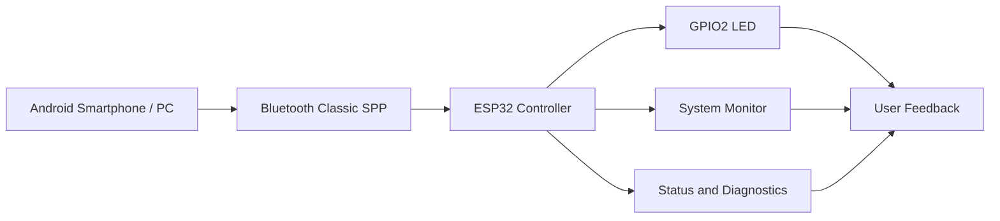
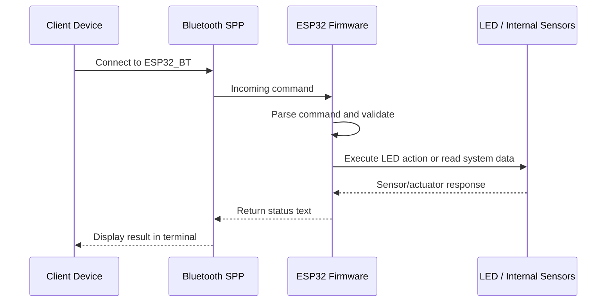
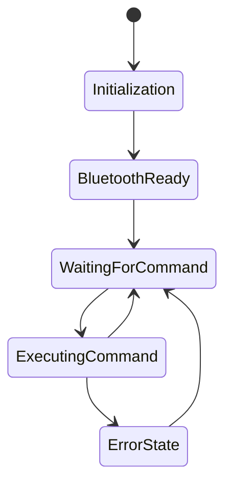
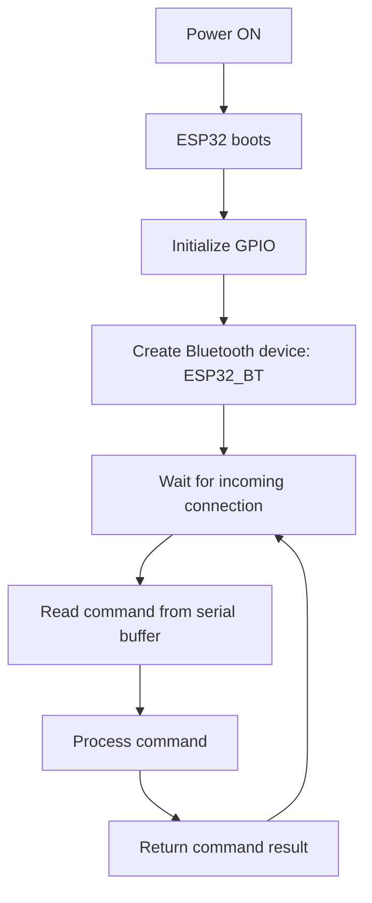

# ESP32 Bluetooth Remote Control & System Monitor

<p align="center">
  
  
  
  
</p>

A compact ESP32 project for remote control and live system diagnostics over Bluetooth Classic (SPP). The device creates a serial channel with a smartphone or PC, accepts textual commands, and returns real-time feedback.

This repository demonstrates a practical embedded application that combines:

- Bluetooth serial communication
- Real-time LED control
- Embedded system reporting
- Remote diagnostics over a lightweight terminal interface
- Educational examples for ESP32 development and serial command handling

---

## Overview

The firmware runs on an ESP32 and exposes a simple command interface through `BluetoothSerial`. A client application such as a smartphone terminal or a desktop serial tool connects to the ESP32, sends commands, and reads diagnostic responses.

The system is intentionally simple and robust:

- onboard LED at GPIO 2 is used as the output actuator
- commands are interpreted in `loop()` from the Bluetooth serial buffer
- each command triggers a controlled action or diagnostic response
- asynchronous blinking is handled with `millis()` to avoid blocking delays

---

## System Architecture



The architecture follows a classic embedded control model:

- the client initiates a Bluetooth connection
- the ESP32 listens for commands on the serial channel
- the firmware performs the requested action
- the result is sent back over Bluetooth to the client

---

## Data Flow Diagram



The command/response pattern is simple and consistent:

1. Device connects over Bluetooth
2. Command is read from the serial buffer
3. Firmware executes logic
4. Response is sent back as text
5. Client displays or logs the result

---

## State Machine



The firmware has a straightforward operational lifecycle:

- initialize serial and pins
- enable Bluetooth device name `ESP32_BT`
- wait for incoming command
- parse and execute the request
- return output to the client

---

## Hardware and Wiring

### Required Hardware

| Component | Purpose |
| --- | --- |
| ESP32 Dev Module | Main controller |
| LED | Visual output indicator |
| 220Ω resistor | Current limiting for LED |
| Jumper wires | Connection between GPIO and LED |
| 3.3V power source | Board power |

### Minimal Electrical Schematic

```text
              +3.3V
                |
                |
             [ESP32]
                |
                +---- GPIO2 ----[220Ω]----|<|---- GND
                         (LED indicator)
```

### Pin Mapping

| ESP32 Pin | Connection |
| --- | --- |
| GPIO 2 | Onboard LED / status indicator |
| GND | LED cathode return |
| 3V3 | Power rail |

> No external sensor is required for this example. Most telemetry is obtained directly from the ESP32 internal hardware and runtime APIs.

---

## Software Architecture

```mermaid
flowchart TD
    A[setup()] --> B[Serial.begin(115200)]
    B --> C[pinMode(LED, OUTPUT)]
    C --> D[SerialBT.begin("ESP32_BT")]
    D --> E[loop()]
    E --> F{Bluetooth data available?}
    F -- Yes --> G[Read command]
    G --> H[executa_comando(cmd)]
    H --> I{Command type}
    I --> J[LED control]
    I --> K[System telemetry]
    I --> L[Unknown command]
    J --> M[Return status]
    K --> M
    L --> M
    M --> E
    F -- No --> E
```

The firmware is organized around two main functions:

- `setup()` initializes communication and GPIO
- `loop()` continuously monitors incoming Bluetooth traffic
- `executa_comando()` handles all recognized commands and dispatches the correct logic

---

## Features

The project supports the following remote features:

- Bluetooth Classic communication using SPP
- LED on/off control
- Configurable LED blink pattern
- Continuous asynchronous blinking mode
- Internal CPU temperature reading
- CPU core, model, and frequency reporting
- RAM usage and heap diagnostics
- Flash memory information
- Uptime reporting
- MAC address lookup
- Wi-Fi network information
- Last reset reason detection

---

## Supported Commands

The ESP32 accepts plain text commands through the Bluetooth serial channel.

| Command | Description | Example |
| --- | --- | --- |
| `LED_ON` | Turns LED on | `LED_ON` |
| `LED_OFF` | Turns LED off | `LED_OFF` |
| `LED_PISCA:10:250` | Blink LED N times with delay in ms | `LED_PISCA:5:500` |
| `LED_BLINK:500` | Start asynchronous blinking at interval | `LED_BLINK:500` |
| `TEMP` | Read internal ESP32 temperature | `TEMP` |
| `CPU` | Read CPU model, revision, cores, and frequency | `CPU` |
| `RAM` | Read heap and allocation statistics | `RAM` |
| `FLASH` | Read flash memory parameters | `FLASH` |
| `INIT` | Read reset reason | `INIT` |
| `UPTIME` | Read device uptime in ms | `UPTIME` |
| `MAC` | Read device MAC address | `MAC` |
| `NET_INFO` | Read IP, gateway, subnet, RSSI, SSID | `NET_INFO` |

### Command Examples

```text
LED_ON
LED_OFF
LED_PISCA:10:250
LED_BLINK:500
TEMP
CPU
RAM
FLASH
INIT
UPTIME
MAC
NET_INFO
```

---

## Example Responses

```text
> LED_ON
LED ligado
```

```text
> TEMP
CPU Temp: 43.25
```

```text
> CPU
Modelo: 1
Revisão: 1
Núcleos: 2
CPU: 240 MHz
RAM livre: 280000 bytes
```

> Note: `ESP.getChipModel()` returns a numeric chip-model identifier from the ESP32 Arduino core. The exact value may vary by board and library version, so the model number is shown as a representative example.

```text
> NET_INFO
IP: 192.168.1.42
Gateway: 192.168.1.1
Mascara de rede: 255.255.255.0
RSSI: -52 dbm
Nome da Rede: MyWiFi
```

---

## Communication Protocol

The application uses a simple human-readable serial protocol over Bluetooth SPP:

- commands are sent as newline-terminated strings
- `cmd.trim()` clears surrounding whitespace
- each command is matched against known patterns
- response is printed back to the same Bluetooth channel

This makes the project especially friendly for:

- Android terminal apps
- manual validation
- rapid prototyping
- educational experiments
- embedded systems testing

---

## Startup Sequence



The device begins in a passive monitoring state and remains ready to receive commands until power is removed or the connection is lost.

---

## Recommended Android Terminal App

For testing with Android devices, the recommended application is:

- Serial Bluetooth Terminal by Kai Morich

### Features

- connect to an SPP Bluetooth device
- send custom commands manually
- view live responses in real time
- create quick-access command macros
- observe debug output clearly

### Connection Steps

1. Power on the ESP32.
2. Pair the phone with the device named `ESP32_BT`.
3. Open the Bluetooth terminal application.
4. Select the paired ESP32 device.
5. Connect to it.
6. Type one of the supported commands and read the response.

---

## Quick Start

### 1. Open the project

The main firmware is contained in:

```text
bluetooth.ino
```

### 2. Compile and upload

Use the Arduino IDE or an equivalent ESP32-compatible toolchain with the required board support package.

### 3. Pair the device

Connect with any Bluetooth Classic client and use the device name:

```text
ESP32_BT
```

### 4. Send commands

Example session:

```text
> TEMP
CPU Temp: 41.20

> LED_ON
LED ligado

> CPU
Modelo: 1
Revisão: 1
Núcleos: 2
CPU: 240 MHz
RAM livre: 280000 bytes
```

---

## Typical Use Cases

- Bluetooth-based educational prototypes
- IoT device experimentation
- local embedded system monitoring
- wireless LED control
- real-time diagnostics without Wi-Fi dependence
- teaching Bluetooth Classic on ESP32
- simple instrumentation and proof-of-concept development

---

## Project Summary

This project is a practical and compact demonstration of Bluetooth Classic communication on the ESP32. It combines a simple LED control interface with a diagnostic command set that reads data from the device internals and exposes it over a wireless serial connection.

The result is a fast, readable example of:

- embedded control logic
- Bluetooth serial communication
- hardware abstraction through Arduino APIs
- asynchronous timing with `millis()`
- system information reporting from an ESP32

---

## Author

Paulo Cesar Furlanetto Marques

Professor • Developer • IoT, Networking, and Embedded Systems Enthusiast

GitHub: https://github.com/paulocfmarques-collab

---

## Support the Project

If this project was useful to you:

- star the repository
- share it with other developers
- fork it and extend it
- contribute improvements or new command features

---

## License

This project is distributed under the MIT license.

---

<p align="center">
  <sub>ESP32 Bluetooth Remote Control & System Monitor</sub>
</p>
