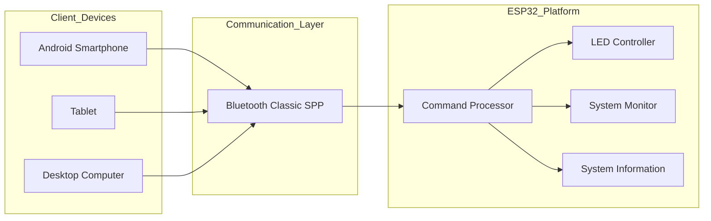
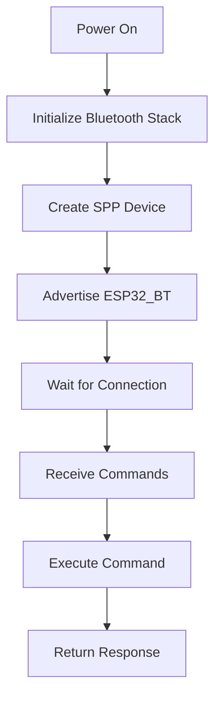
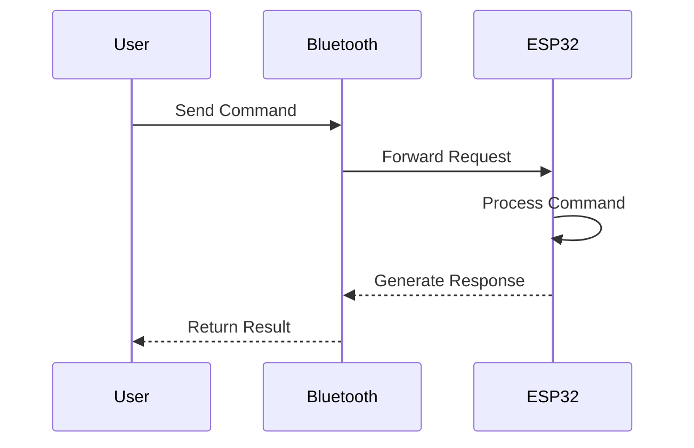
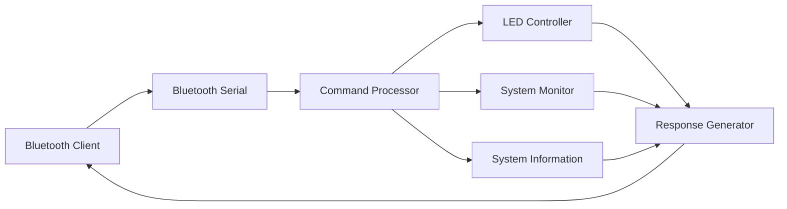

# ESP32 Bluetooth Device Management Platform

<p align="center">


</p>

<p align="center">
A professional Bluetooth-based monitoring, diagnostics, and remote control platform for ESP32 devices.
</p>

---

## 📋 Table of Contents

- 📖 Overview
- ✨ Key Capabilities
- 🏗️ Software Architecture
- 🚀 Startup Sequence
- 📡 Bluetooth Communication
- 📱 Android Integration
- 📑 Command Reference
- 📊 Project Status
- 🧩 Core Components
- 🎯 Target Applications
- 🛣️ Roadmap
- 📄 License

---

# 📖 Overview

The ESP32 Bluetooth Device Management Platform provides a lightweight and extensible framework for remote control, system monitoring, and diagnostics using Bluetooth Classic Serial Port Profile (SPP).

The platform enables direct communication between smartphones, tablets, computers, and ESP32 devices without requiring Wi-Fi infrastructure, Internet connectivity, cloud services, or external dependencies.

Designed around a modular architecture, the platform supports remote command execution, hardware control, operational monitoring, and diagnostics through a simple command-based interface.

---

# ✨ Key Capabilities

🔵 Bluetooth Classic (SPP) Communication

🟢 Remote Device Administration

🟡 Command-Based Control Interface

🔴 LED Control and Status Signaling

🟣 Continuous and Timed Blink Modes

🟠 CPU Diagnostics

🟤 RAM Monitoring

⚪ Flash Memory Information

🔷 Internal Temperature Monitoring

🔶 Device Uptime Reporting

🟩 MAC Address Retrieval

🟦 Network Information Reporting

⚙️ Modular Architecture

🧩 Easily Extensible Command Framework

📱 Android Smartphone Compatibility

💻 Desktop Bluetooth Terminal Compatibility

---

# 🏗️ Software Architecture

The platform is organized into independent modules responsible for communication, command processing, monitoring, and hardware control.


```mermaid
flowchart LR

    subgraph Client_Devices
        PHONE[Android Smartphone]
        PC[Desktop Computer]
        TABLET[Tablet]
    end

    subgraph Communication_Layer
        BT[Bluetooth Classic SPP]
    end

    subgraph ESP32_Platform

        CMD[Command Processor]

        LED[LED Controller]

        MON[System Monitor]

        INFO[System Information]

    end

    PHONE --> BT
    TABLET --> BT
    PC --> BT

    BT --> CMD

    CMD --> LED
    CMD --> MON
    CMD --> INFO
```

---

# 🚀 Startup Sequence


```mermaid
flowchart TD

    A[Power On] --> B[Initialize Bluetooth Stack]

    B --> C[Create SPP Device]

    C --> D[Advertise ESP32_BT]

    D --> E[Wait for Connection]

    E --> F[Receive Commands]

    F --> G[Execute Command]

    G --> H[Return Response]
```

---

# 📡 Bluetooth Communication

The platform uses Bluetooth Classic Serial Port Profile (SPP) for bidirectional communication.

## Device Name

```text
ESP32_BT
```

## Communication Flow


```mermaid
sequenceDiagram

    participant User
    participant Bluetooth
    participant ESP32

    User->>Bluetooth: Send Command

    Bluetooth->>ESP32: Forward Request

    ESP32->>ESP32: Process Command

    ESP32-->>Bluetooth: Generate Response

    Bluetooth-->>User: Return Result
```

---

# 📱 Android Integration

## Recommended Application

### Serial Bluetooth Terminal

Recommended Features:

- Real-time communication
- Command history
- Custom macros
- Custom buttons
- Communication logging
- UTF-8 support

## Connection Procedure

1. Power on the ESP32.
2. Pair the smartphone with the device.
3. Open Serial Bluetooth Terminal.
4. Select **ESP32_BT**.
5. Connect.
6. Send commands through the terminal interface.

---

# 📑 Command Reference

## Hardware Control Commands

| Command | Description |
|----------|-------------|
| `LED_ON` | Turns the onboard LED on |
| `LED_OFF` | Turns the onboard LED off |
| `LED_BLINK:<interval>` | Starts continuous blinking |
| `LED_PISCA:<count>:<delay>` | Executes a finite blink sequence |

### Examples

```text
LED_ON
```

```text
LED_OFF
```

```text
LED_BLINK:500
```

```text
LED_PISCA:10:250
```

---

## Monitoring Commands

| Command | Description |
|----------|-------------|
| `TEMP` | Returns internal temperature |
| `CPU` | Returns processor information |
| `RAM` | Returns memory statistics |
| `FLASH` | Returns flash information |
| `UPTIME` | Returns device uptime |

### Examples

```text
TEMP
```

```text
CPU
```

```text
RAM
```

```text
FLASH
```

```text
UPTIME
```

---

## Device Information Commands

| Command | Description |
|----------|-------------|
| `MAC` | Returns device MAC address |
| `NET_INFO` | Returns network information |
| `INIT` | Returns last reset reason |

### Examples

```text
MAC
```

```text
NET_INFO
```

```text
INIT
```

---

# 📈 Project Status

| Feature | Status |
|----------|----------|
| Bluetooth Communication | ✅ Stable |
| Command Processing | ✅ Stable |
| LED Control | ✅ Stable |
| Hardware Monitoring | ✅ Stable |
| CPU Diagnostics | ✅ Stable |
| RAM Monitoring | ✅ Stable |
| Flash Monitoring | ✅ Stable |
| Documentation | ✅ Stable |
| BLE Support | 🚧 Planned |
| Authentication | 🚧 Planned |
| OTA Updates | 🚧 Planned |

---

# 🧩 Core Components

## BluetoothManager

Responsible for Bluetooth communication.

### Capabilities

- Device discovery
- Pairing support
- Connection management
- Data transport

---

## CommandProcessor

Responsible for command execution.

### Capabilities

- Command parsing
- Parameter validation
- Routing
- Response generation

---

## LEDController

Responsible for all LED operations.

### Capabilities

- ON / OFF control
- Timed blinking
- Continuous blinking
- Status indication

---

## SystemMonitor

Responsible for device diagnostics.

### Monitored Resources

- CPU
- RAM
- Flash Storage
- Temperature
- Uptime

---

## SystemInformation

Responsible for platform metadata.

### Available Information

- MAC Address
- Reset Reason
- Network Information

---

# 📊 Command Processing Flow


```mermaid
flowchart LR

    CLIENT[Bluetooth Client]
        --> BT[Bluetooth Serial]

    BT --> CMD[Command Processor]

    CMD --> LED[LED Controller]
    CMD --> MON[System Monitor]
    CMD --> INFO[System Information]

    LED --> RESPONSE[Response Generator]
    MON --> RESPONSE
    INFO --> RESPONSE

    RESPONSE --> CLIENT
```

---

# 🎯 Target Applications

- Industrial Bluetooth Controllers
- Laboratory Equipment
- Embedded Systems Education
- Smart Home Devices
- Field Diagnostic Tools
- Standalone Monitoring Devices
- Maintenance Terminals
- Research and Development Projects

---

# 🛣️ Roadmap

## Completed

- [x] Bluetooth Classic Communication
- [x] Command Processing Framework
- [x] LED Control
- [x] Device Monitoring
- [x] Command-Based Diagnostics

## Planned

- [ ] Bluetooth Low Energy (BLE)
- [ ] Authentication Layer
- [ ] JSON Command Protocol
- [ ] OLED Display Support
- [ ] SD Card Logging
- [ ] RGB Status LED
- [ ] OTA Updates
- [ ] Sensor Framework

---

# 💡 Design Principles

The platform was developed following the principles of:

- Modularity
- Maintainability
- Extensibility
- Hardware Abstraction
- Simplicity

The communication layer is intentionally lightweight, enabling reliable remote administration and diagnostics without relying on Wi-Fi networks or cloud infrastructure.

The architecture allows new commands, peripherals, and monitoring capabilities to be integrated with minimal impact on existing components.

---

# 📄 License

This project is released under the license specified by the repository owner.

---

<p align="center">

Built with ❤️ using ESP32 and Arduino Framework

</p>

<p align="center">


</p>
