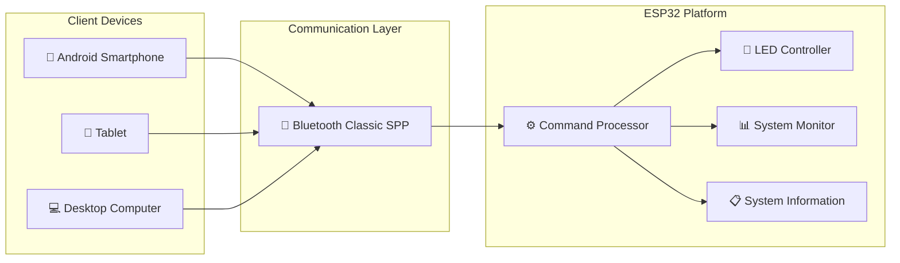
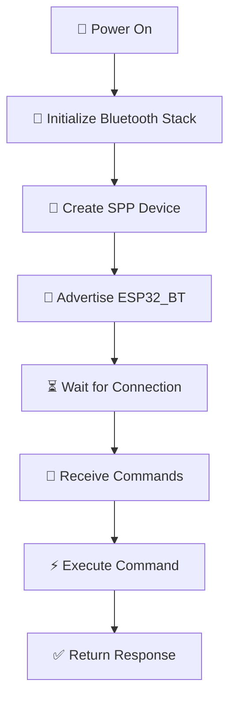
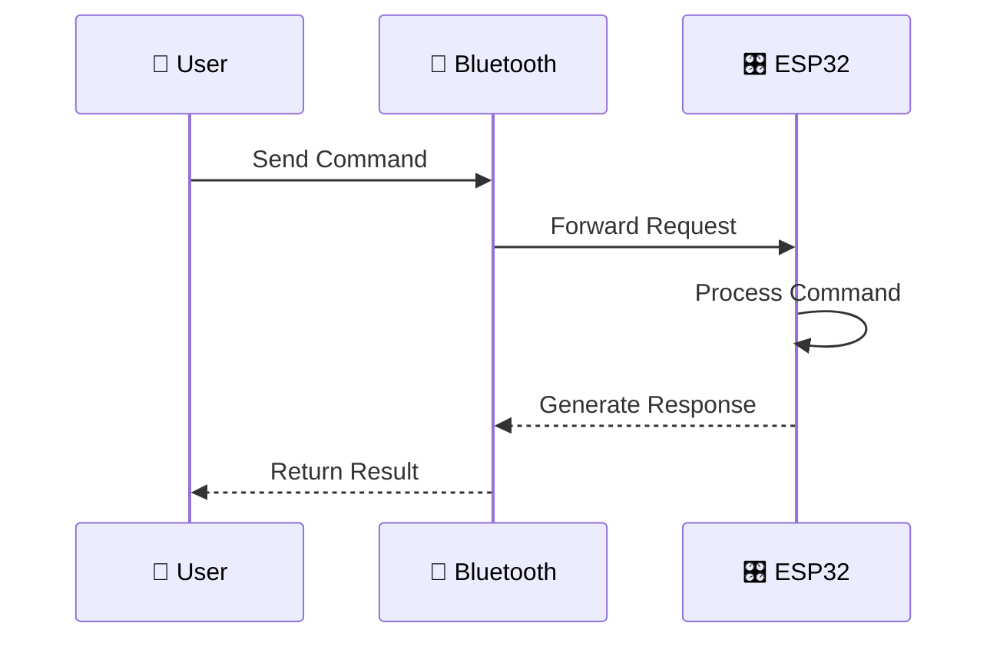
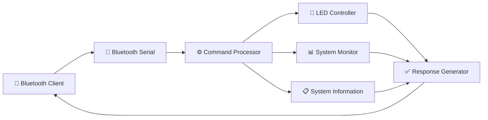

# ESP32 Bluetooth Device Management Platform

<div align="center">


A professional Bluetooth-based monitoring, diagnostics, and remote control platform for ESP32 devices.

</div>

---

## 📋 Table of Contents

- [📖 Overview](#-overview)
- [✨ Key Capabilities](#-key-capabilities)
- [🏗️ Software Architecture](#️-software-architecture)
- [🚀 Startup Sequence](#-startup-sequence)
- [📡 Bluetooth Communication](#-bluetooth-communication)
- [📱 Android Integration](#-android-integration)
- [📑 Command Reference](#-command-reference)
- [📊 Project Status](#-project-status)
- [🧩 Core Components](#-core-components)
- [🎯 Target Applications](#-target-applications)
- [🛣️ Roadmap](#️-roadmap)
- [💡 Design Principles](#-design-principles)
- [📄 License](#-license)

---

## 📖 Overview

The **ESP32 Bluetooth Device Management Platform** provides a lightweight and extensible framework for remote control, system monitoring, and diagnostics using Bluetooth Classic Serial Port Profile (SPP).

The platform enables direct communication between smartphones, tablets, computers, and ESP32 devices without requiring:
- Wi-Fi infrastructure
- Internet connectivity
- Cloud services
- External dependencies

Designed around a **modular architecture**, the platform supports:
- Remote command execution
- Hardware control
- Operational monitoring
- Real-time diagnostics

---

## ✨ Key Capabilities

| Feature | Icon |
|---------|------|
| Bluetooth Classic (SPP) Communication | 🔵 |
| Remote Device Administration | 🟢 |
| Command-Based Control Interface | 🟡 |
| LED Control and Status Signaling | 🔴 |
| Continuous and Timed Blink Modes | 🟣 |
| CPU Diagnostics | 🟠 |
| RAM Monitoring | 🟤 |
| Flash Memory Information | ⚪ |
| Internal Temperature Monitoring | 🔷 |
| Device Uptime Reporting | 🔶 |
| MAC Address Retrieval | 🟩 |
| Network Information Reporting | 🟦 |
| Modular Architecture | ⚙️ |
| Easily Extensible Command Framework | 🧩 |
| Android Smartphone Compatibility | 📱 |
| Desktop Bluetooth Terminal Compatibility | 💻 |

---

## 🏗️ Software Architecture

The platform is organized into independent modules responsible for communication, command processing, monitoring, and hardware control.


```mermaid
flowchart LR
    subgraph Client_Devices["Client Devices"]
        PHONE["📱 Android Smartphone"]
        PC["💻 Desktop Computer"]
        TABLET["📱 Tablet"]
    end

    subgraph Communication_Layer["Communication Layer"]
        BT["🔵 Bluetooth Classic SPP"]
    end

    subgraph ESP32_Platform["ESP32 Platform"]
        CMD["⚙️ Command Processor"]
        LED["🔴 LED Controller"]
        MON["📊 System Monitor"]
        INFO["📋 System Information"]
    end

    PHONE --> BT
    TABLET --> BT
    PC --> BT

    BT --> CMD

    CMD --> LED
    CMD --> MON
    CMD --> INFO
```

---

## 🚀 Startup Sequence


```mermaid
flowchart TD
    A["🔌 Power On"] --> B["🔧 Initialize Bluetooth Stack"]
    B --> C["📡 Create SPP Device"]
    C --> D["📢 Advertise ESP32_BT"]
    D --> E["⏳ Wait for Connection"]
    E --> F["📨 Receive Commands"]
    F --> G["⚡ Execute Command"]
    G --> H["✅ Return Response"]
```

---

## 📡 Bluetooth Communication

The platform uses **Bluetooth Classic Serial Port Profile (SPP)** for bidirectional communication.

### Device Name

```
ESP32_BT
```

### Communication Flow


```mermaid
sequenceDiagram
    participant User as 👤 User
    participant BT as 📡 Bluetooth
    participant ESP32 as 🎛️ ESP32

    User->>BT: Send Command
    BT->>ESP32: Forward Request
    ESP32->>ESP32: Process Command
    ESP32-->>BT: Generate Response
    BT-->>User: Return Result
```

---

## 📱 Android Integration

### Recommended Application: Serial Bluetooth Terminal

**Recommended Features:**
- ✅ Real-time communication
- ✅ Command history
- ✅ Custom macros
- ✅ Custom buttons
- ✅ Communication logging
- ✅ UTF-8 support

### Connection Procedure

1. Power on the ESP32
2. Pair the smartphone with the device
3. Open Serial Bluetooth Terminal
4. Select **ESP32_BT**
5. Connect
6. Send commands through the terminal interface

---

## 📑 Command Reference

### Hardware Control Commands

| Command | Description | Example |
|---------|-------------|---------|
| `LED_ON` | Turns the onboard LED on | `LED_ON` |
| `LED_OFF` | Turns the onboard LED off | `LED_OFF` |
| `LED_BLINK:<interval>` | Starts continuous blinking | `LED_BLINK:500` |
| `LED_PISCA:<count>:<delay>` | Executes a finite blink sequence | `LED_PISCA:10:250` |

---

### Monitoring Commands

| Command | Description | Example |
|---------|-------------|---------|
| `TEMP` | Returns internal temperature | `TEMP` |
| `CPU` | Returns processor information | `CPU` |
| `RAM` | Returns memory statistics | `RAM` |
| `FLASH` | Returns flash information | `FLASH` |
| `UPTIME` | Returns device uptime | `UPTIME` |

---

### Device Information Commands

| Command | Description | Example |
|---------|-------------|---------|
| `MAC` | Returns device MAC address | `MAC` |
| `NET_INFO` | Returns network information | `NET_INFO` |
| `INIT` | Returns last reset reason | `INIT` |

---

## 📊 Project Status

| Feature | Status | Version |
|---------|--------|---------|
| Bluetooth Communication | ✅ Stable | 1.0 |
| Command Processing | ✅ Stable | 1.0 |
| LED Control | ✅ Stable | 1.0 |
| Hardware Monitoring | ✅ Stable | 1.0 |
| CPU Diagnostics | ✅ Stable | 1.0 |
| RAM Monitoring | ✅ Stable | 1.0 |
| Flash Monitoring | ✅ Stable | 1.0 |
| Documentation | ✅ Stable | 1.0 |
| BLE Support | 🚧 Planned | Q4 2026 |
| Authentication | 🚧 Planned | Q1 2027 |
| OTA Updates | 🚧 Planned | Q1 2027 |

---

## 🧩 Core Components

### BluetoothManager
**Responsible for Bluetooth communication**

**Capabilities:**
- Device discovery
- Pairing support
- Connection management
- Data transport

---

### CommandProcessor
**Responsible for command execution**

**Capabilities:**
- Command parsing
- Parameter validation
- Routing
- Response generation

---

### LEDController
**Responsible for all LED operations**

**Capabilities:**
- ON / OFF control
- Timed blinking
- Continuous blinking
- Status indication

---

### SystemMonitor
**Responsible for device diagnostics**

**Monitored Resources:**
- CPU
- RAM
- Flash Storage
- Temperature
- Uptime

---

### SystemInformation
**Responsible for platform metadata**

**Available Information:**
- MAC Address
- Reset Reason
- Network Information

---

## 📊 Command Processing Flow


```mermaid
flowchart LR
    CLIENT["👤 Bluetooth Client"]
    --> BT["📡 Bluetooth Serial"]
    --> CMD["⚙️ Command Processor"]

    CMD --> LED["🔴 LED Controller"]
    CMD --> MON["📊 System Monitor"]
    CMD --> INFO["📋 System Information"]

    LED --> RESPONSE["✅ Response Generator"]
    MON --> RESPONSE
    INFO --> RESPONSE

    RESPONSE --> CLIENT
```

---

## 🎯 Target Applications

- 🏭 Industrial Bluetooth Controllers
- 🔬 Laboratory Equipment
- 🎓 Embedded Systems Education
- 🏠 Smart Home Devices
- 🔧 Field Diagnostic Tools
- 📊 Standalone Monitoring Devices
- 🛠️ Maintenance Terminals
- 📚 Research and Development Projects

---

## 🛣️ Roadmap

### ✅ Completed
- [x] Bluetooth Classic Communication
- [x] Command Processing Framework
- [x] LED Control
- [x] Device Monitoring
- [x] Command-Based Diagnostics
- [x] Complete Documentation

### 🚧 Planned
- [ ] Bluetooth Low Energy (BLE) Support
- [ ] Authentication & Security Layer
- [ ] JSON Command Protocol
- [ ] OLED Display Support
- [ ] SD Card Logging
- [ ] RGB Status LED
- [ ] OTA Updates
- [ ] Sensor Framework Extension

---

## 💡 Design Principles

The platform was developed following core principles of:

| Principle | Description |
|-----------|-------------|
| **Modularity** | Independent, reusable components |
| **Maintainability** | Clean, well-documented code |
| **Extensibility** | Easy addition of new features |
| **Hardware Abstraction** | Platform-agnostic design |
| **Simplicity** | Lightweight, efficient implementation |

### Architecture Philosophy

The communication layer is intentionally **lightweight**, enabling:
- ✅ Reliable remote administration
- ✅ Real-time diagnostics
- ✅ No Wi-Fi dependency
- ✅ No cloud infrastructure required

The modular architecture allows new commands, peripherals, and monitoring capabilities to be integrated with **minimal impact** on existing components.

---

## 📄 License

This project is released under the **MIT License**. See LICENSE file for details.

---

<div align="center">

### 🤝 Contributing

Contributions are welcome! Please feel free to submit a Pull Request.

### 📧 Contact

For questions, issues, or suggestions, please open an issue on GitHub.

### 💝 Built with ❤️

**ESP32 • Arduino • Bluetooth • C++**


</div>
